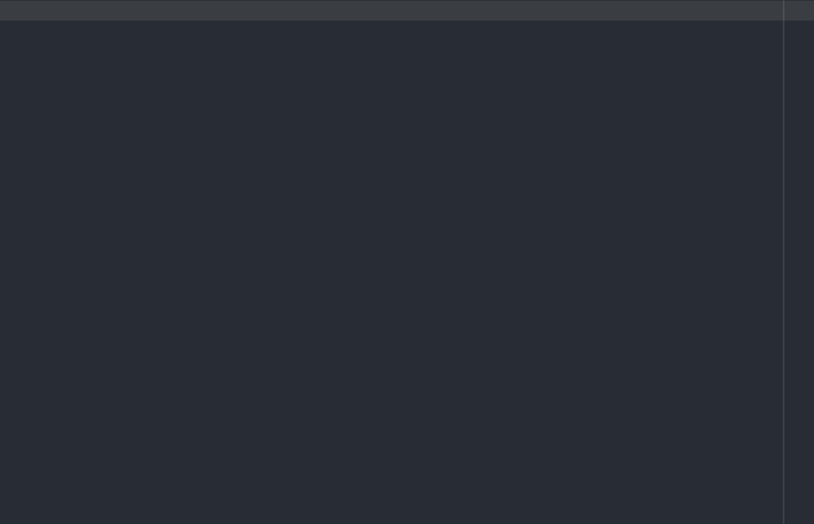

# remote-ssh package

## Introduction
Remote SSH is a little helper tool originally for Windows to quickly start Putty and connect to a potential server you are currently working on.
While the default SSH client is Putty, Remote SSH supports the default SSH client of Linux and Mac, or any other ssh client called ssh that is globally accessible, too.
The ability to start alternative SSH clients depends on the particular implementation off that SSH client and your OS.

## Using Remote SSH
For Remote SSH to work you need a .ftpconfig file in your project folder in the format of _at least_
```
{
    "protocol": "sftp",
    "host": "",
    "port": 22,
    "user": "user",
    "pass": "pass",

    "session": "",
    "rs_name": "",
    "rs_tags": []
}
```

Wheras SFTP is default for Remote SSH.

## Putty specific options in .ftpconfig
The `session` option was added in case you have saved sessions inside your Putty and you want to re-use those. Just enter the name of your saved session.
For Remote SSH to work with Putty, it should be in a global (environment) path, making it accessible from everywhere.  
A present non-empty `session` takes precedence over any other option in the config file.

## Remote SSH specific options in .ftpconfig
There is support for two new entries available inside .ftpconfig:  
`rs_name`: String, an alias for the project. Should be unique for quick searches.  
`rs_tags`: Array of strings, tags for a project. Encouraged to be shared by multiple projects.  

These two options are entirely optional to use. They only take effect when you check the setting `Scan for ftpconfig files` (opt-in) and set the appropriate project folders all your Atom projects reside in.  

If you do, you can search for any ftpconfig file inside your project folders and start a new ssh connection from your currently opened project. No need to change the project first (anymore \o/).  

The scan looks only through `rs_name` and `rs_tags`, folder name and `host` and saves those.
Credentials are _not stored_ for the search.

### Keep in mind  
For performance reasons Remote SSH scans only _one level_ deep.  
Imagine the horror of a renamed folder with node_modules content being scanned.  
Let's say your project folder looks like this:

```
C:/AtomProjects/  
├──project1
|      .ftpconfig  
|
├──project2
|      .ftpconfig
|
├──superproject
|  |   .ftpconfig
|  |
|  └───subproject
|          .ftpconfig
```

You entered `C:/AtomProjects` in the settings as your global project folder. `subproject` will not be scanned but `superproject` will be.  
You can enter multiple "global" project folders separated by a comma if you spread your projects on different locations. To have subproject available as well you can enter `C:/AtomProjects,C:/AtomProjects/superproject/subproject`.  

To keep this feature slick and easy, there's nothing automatically observing changes in ftpconfig files either. If you change anything manually, or add a new project, you need to do a rescan. Use `CTRL+ALT+D` to do that.

## Search result formatting
Remote SSH uses the default SelectListView of Atom to display the results.
To change the way the search results are displayed, there are three available keywords to use in the settings:
`{hostName}`, `{projectName}`,  and `{folderName}`  
HTML is supported as well. So please, break Atom responsibly. :)

If any of the former two are not defined in the respective .ftpconfig, they will be displayed as is. To avoid that you can prefix the keywords inside the brackets with a question mark, in such cases nothing will be displayed for undefined values (i.e. `{?projectName}`).

Minimal default string:
```HTML
{projectName}<small class="pull-right">{folderName}</small>
```

Useful alternative, closing div after small is by purpose to close the first line:
```HTML
{hostName}<small class="pull-right">{?projectName}</small></div><div class="new-line"><small class="pull-right">{folderName}</small>
```

### Example with alternative


## Alternative SSH clients
To work with any other ssh client that ssh client must be named "ssh" and in your environment path.

## Available shortcuts

Shortcut | Function
------------ | -------------
`CTRL+ALT+R` | Start a new SSH connection with credentials of the ftpconfig file in the currently opened folder
`CTRL+ALT+F` | Create a new .ftpconfig file in currently opened folder  
`CTRL+ALT+S` | Open a search modal for ftpconfig files, only available if you checked the setting "Scan for ftpconfig files" and entered project folders
`CTRL+ALT+D` | Rescan ftpconfig files, use when you manually changed ftpconfig files or created new projects
